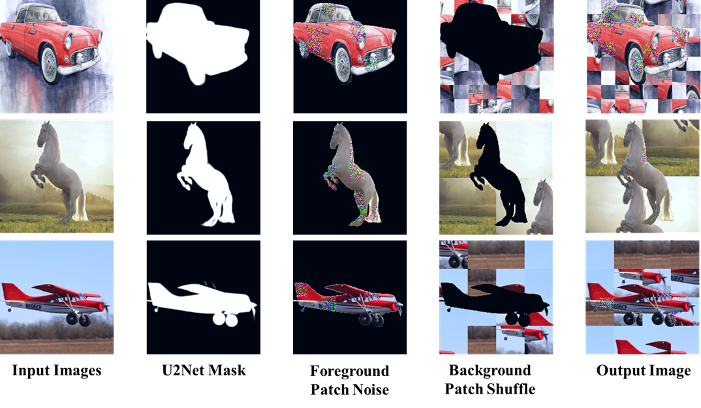
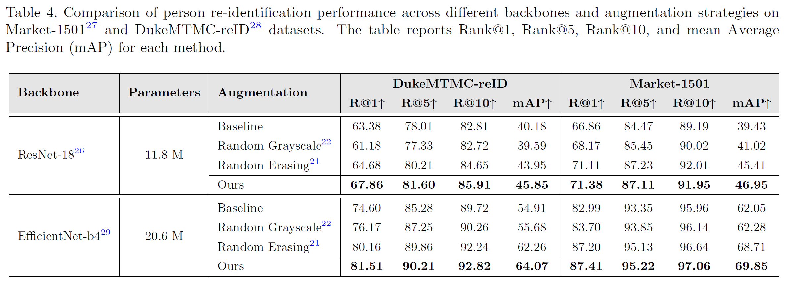

# <p align="center">Dual-Region Foreground-Background Augmentation (DRA)</p>

<p align="center">
  <a href="https://arxiv.org/abs/2504.13077"></a>
  <a href="https://paperswithcode.com/paper/effective-dual-region-augmentation-for"></a>
  <a href="LICENSE"></a>
  <a href="https://visitor-badge.laobi.icu/badge?page_id=PrasannaPulakurthi/Foreground-Background-Augmentation">
    
  </a>
</p>

---

Code for our 2025 paper "**Effective Dual-Region Augmentation for Reduced Reliance on Large Amounts of Labeled Data**," by [Prasanna Reddy Pulakurthi](https://www.prasannapulakurthi.com/), [Majid Rabbani](https://www.rit.edu/directory/mxreee-majid-rabbani), [Celso M. de Melo](https://celsodemelo.net/), [Sohail A. Dianat](https://www.rit.edu/directory/sadeee-sohail-dianat), and [Raghuveer Rao](https://ieeexplore.ieee.org/author/37281258600). [[PDF]](https://arxiv.org/abs/2504.13077)

**Keywords:** Data Augmentation, Classification, Source-Free Domain Adaptation (SFDA), Person Re-Identification (ReID)

---

## Overview

We introduce a novel **dual-region augmentation** approach that reduces reliance on large-scale labeled datasets while improving model robustness across diverse computer vision tasks.

Our method applies:
- **Random noise perturbations** to foreground objects.
- **Spatial shuffling** of background patches.

This structured augmentation improves model generalization and robustness without requiring additional supervision.

Evaluations on the PACS dataset (SFDA) and Market-1501, DukeMTMC-reID datasets (ReID) show **consistent improvements over existing methods** across single-target and multi-target settings.

---

## Method Overview

<p align="center">
  
</p>

<p align="center"><i>Overall pipeline of the proposed augmentation process: foreground noise + background shuffle.</i></p>

---

## Visual Examples

We apply random patch noise to the foreground and spatial shuffling to the background to create diverse augmented images.

<p align="center">
  
</p>

<p align="center"><i>Step-by-step illustration of the Foreground-Background Augmentation method: Input Images → U2Net Mask Extraction → Foreground Patch Noise → Background Patch Shuffle → Final Augmented Output.</i></p>

---

## Applications

Our augmentation method can be applied across a variety of tasks, including Source-Free Domain Adaptation (SFDA) and Person Re-Identification (ReID).

<p align="center">
  
</p>

<p align="center"><i>Examples of augmented outputs generated by applying Foreground Patch Noise and Background Patch Shuffling.</i></p>

### Source-Free Domain Adaptation (SFDA)
Implementation details and training scripts are available in [`./SFDA/`](./SFDA/).

### Person Re-Identification (ReID)
Implementation details and training scripts are available in [`./Person_ReID/`](./Person_ReID/).

---

## Results

Our method achieves **state-of-the-art performance** across Source-Free Domain Adaptation and Person ReID benchmarks.

### Source-Free Domain Adaptation (SFDA) - PACS Dataset

We evaluate on the PACS dataset for both single-target and multi-target domain adaptation.

<p align="center">
  
</p>

<p align="center"><i>Classification accuracy (%) on PACS dataset. Our method achieves the highest accuracy across both settings.</i></p>

---

### Person Re-Identification (ReID) - Market-1501 and DukeMTMC-reID

We evaluate across ResNet-18 and EfficientNet-b4 backbones, consistently outperforming baselines and existing augmentation techniques.

<p align="center">
  
</p>

<p align="center"><i>Person ReID performance on Market-1501 and DukeMTMC-reID datasets. Our augmentation strategy achieves superior results across all metrics.</i></p>

---

## Citation

If you find this work useful, please cite:

```bibtex
@misc{pulakurthi2025effectivedualregionaugmentationreduced,
      title={Effective Dual-Region Augmentation for Reduced Reliance on Large Amounts of Labeled Data}, 
      author={Prasanna Reddy Pulakurthi and Majid Rabbani and Celso M. de Melo and Sohail A. Dianat and Raghuveer M. Rao},
      year={2025},
      eprint={2504.13077},
      archivePrefix={arXiv},
      primaryClass={cs.CV},
      url={https://arxiv.org/abs/2504.13077}, 
}
